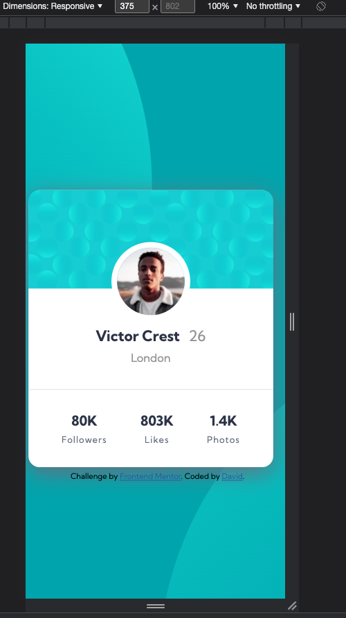

# Frontend Mentor - Profile card component solution

This is a solution to the [Profile card component challenge on Frontend Mentor](https://www.frontendmentor.io/challenges/profile-card-component-cfArpWshJ). Frontend Mentor challenges help you improve your coding skills by building realistic projects.

## Table of contents

- [Overview](#overview)
  - [The challenge](#the-challenge)
  - [Screenshot](#screenshot)
  - [Links](#links)
- [My process](#my-process)
  - [Built with](#built-with)
  - [What I learned](#what-i-learned)
  - [Continued development](#continued-development)
  - [Useful resources](#useful-resources)
- [Author](#author)
- [Acknowledgments](#acknowledgments)

## Overview

Creating a profile card with a mobile first approach

### The challenge

- Build out the project to the designs provided

### Screenshot



### Links

- Solution URL: [Add solution URL here](https://github.com/Kami-No-Musuko/profile-card-component-main)
- Live Site URL: [Add live site URL here](https://your-live-site-url.com)

## My process

### Built with

- Semantic HTML5 markup
- CSS custom properties
- Flexbox
- SCSS
- Mobile-first workflow

### What I learned

Mainly the way to have the pfp of victor on top of the pattern picture using the pattern picture as a background is a pretty interesting method, simple too.

```css
body {
  /* Background Images */
  background-color: $primary1-dark-cyan;
  background-image: url(../images/bg-pattern-top.svg),
    url(../images/bg-pattern-bottom.svg);
  background-repeat: no-repeat;
  background-position: right 52vw bottom 40vh, left 50vw top 50vh;

  /* Layout */
  box-sizing: border-box;
  font-family: $font-family;
  width: 100vw;
  height: 100vh;
}
```

If you want more help with writing markdown, we'd recommend checking out [The Markdown Guide](https://www.markdownguide.org/) to learn more.

### Continued development

Use this section to outline areas that you want to continue focusing on in future projects. These could be concepts you're still not completely comfortable with or techniques you found useful that you want to refine and perfect.

### Useful resources

- [Example resource 1](https://www.W3Schools.com) - This helped me for XYZ reason. I really liked this pattern and will use it going forward.

## Author

- Website - [David](https://d4vidk.uk)
- Frontend Mentor - [@Kami-No-Musuko](https://www.frontendmentor.io/profile/Kami-No-Musuko)
- Twitter - [@Naruto_Onisan](https://twitter.com/Naruto_Onisan)
- Instagram - [@\_d4vidk](https://www.instagram.com/_d4vidk/)

## Acknowledgments

I found their approach interesting.
https://github.com/hesam-fattahi/profile-card-component-main
